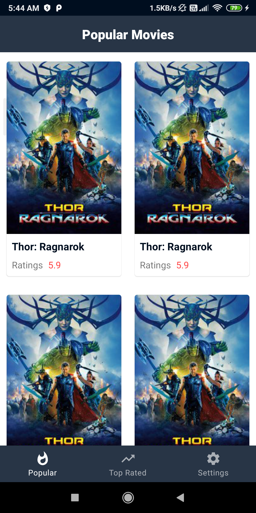
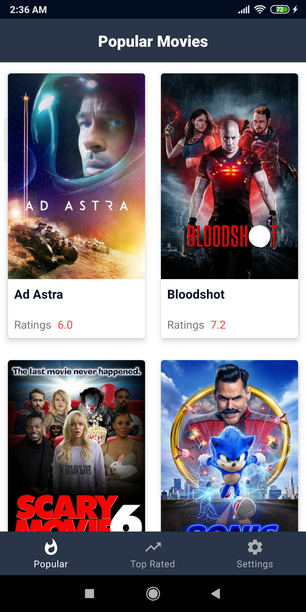

# Popular Movies App

### Part 1
> [Popular Movies Part 1 Branch](https://github.com/What-After-College/PopularMovies/tree/popular-movies-part-1)
- Material Theme
- Create **Bottom Navigation** for Top rated & Popular Movies 
- Setup **Recycler View**
- Design Movie Card

### Part 2
> [Popular Movies Part 2 Branch](https://github.com/What-After-College/PopularMovies/tree/popular-movies-part-2)
- Networking using Retrofit
- Use **LiveData** to observe data streams
- Create **SettingsFragment** and Store API key using **SharedPreferences**
- Load optimised images using Glide

  

